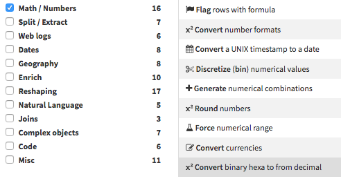
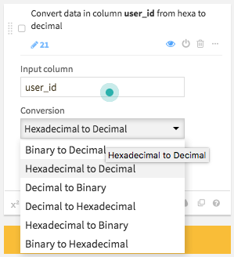

# dss-plugin-numeric-base-conversion
A processor to convert numerical values between hexadecimal, binary and decimal bases

## How to use

- In your project, create a *Prepare Recipe*.
- In the *Prepare Recipe*, press **Add a new step**. In the **Math / Numbers** processors library, select **Convert binary hexa to/from decimal**:

- In *Input column*, select the column containing the numbers to convert
- in *Output column*, set the name of the column which will contain the conversion results
- Select the conversion type according to the base of the source and the expected output base

- Finally, run the recipe.
The content of *input column* will be converted and copied in *output column*
